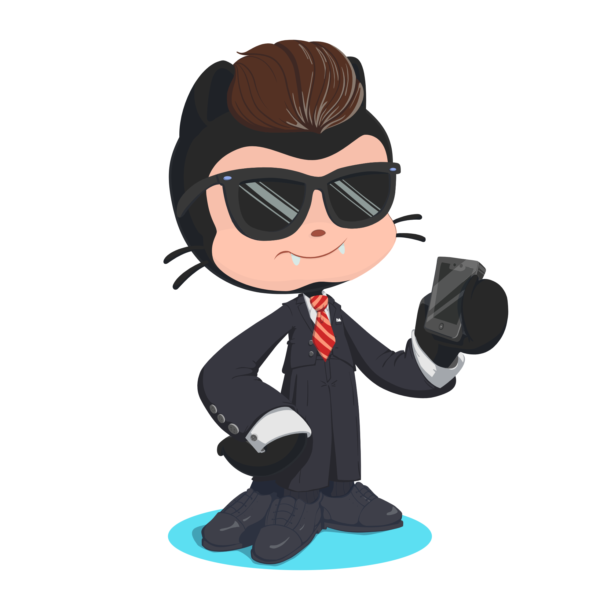

<!----------------------------------------------------------------------------------------------------------------------------------------------------------->
<!-----Typing SVG-------------------------------------------------------------------------------------------------------------------------------------------->
<!----------------------------------------------------------------------------------------------------------------------------------------------------------->

<!----------------------------------------------------------------------------------------------------------------------------------------------------------->
<!-----Visitor Badge----------------------------------------------------------------------------------------------------------------------------------------->
<!----------------------------------------------------------------------------------------------------------------------------------------------------------->

    

 

<!----------------------------------------------------------------------------------------------------------------------------------------------------------->
<!-----Brief Info + Dev Card--------------------------------------------------------------------------------------------------------------------------------->
<!----------------------------------------------------------------------------------------------------------------------------------------------------------->

<!-- Добавить позже наверно -->
 

<i>&nbsp; There's nothing quite like the thrill of having your work recognized and appreciated by the community. </i> 

🎓 &nbsp; I'm in college in my 2nd year. I'm just starting my journey.

🔥 &nbsp; I am eager to learn something new, although it can be very difficult in a couple

<!----------------------------------------------------------------------------------------------------------------------------------------------------------->
<!-----Skills Section---------------------------------------------------------------------------------------------------------------------------------------->
<!----------------------------------------------------------------------------------------------------------------------------------------------------------->

<h2 align="center">Skills

</h2>

